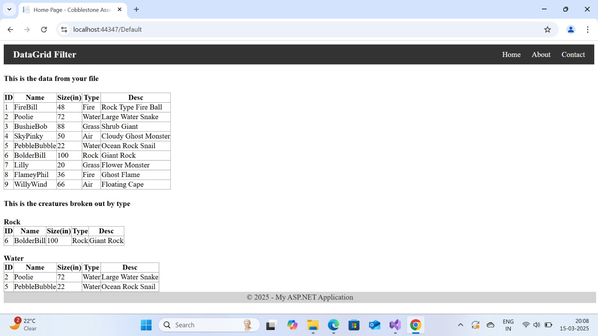
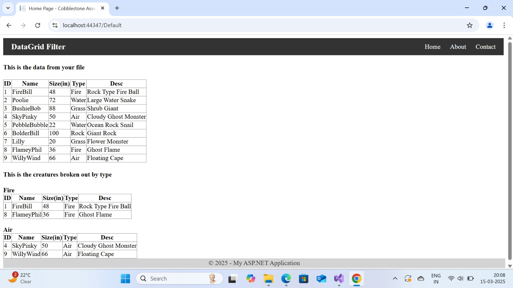
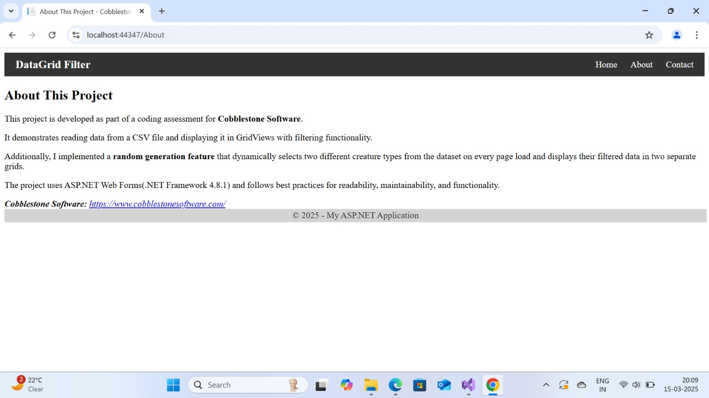
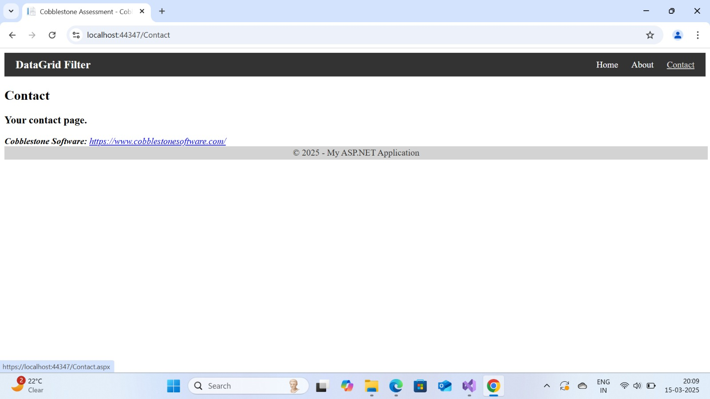

## Coding 2024 Fix - Creatures Data Filtering Project

## Live Demo
**Live Link:** [Click here to view the live application](https://coding2024-fix20250316161701-ducpghbeavejh4cb.centralus-01.azurewebsites.net/Default)

## Overview
This project was developed as part of a coding assessment for Cobblestone Software. It demonstrates the ability to debug and enhance an existing ASP.NET Web Forms project by:
- Reading and displaying data from a CSV file.
- Filtering and displaying creatures based on randomly selected types.
- Structuring an ASP.NET Web Forms site with Home, About, and Contact pages.

The main focus of this application is the **random generation feature** that selects two types of creatures and displays them dynamically on each page load.

---

## Features
- Displays a complete list of creatures from a CSV file in a GridView.
- Randomly selects two creature types from the dataset and displays them in two additional filtered GridViews.
- Simple navigation menu and footer using a Master Page layout.
- Fully implemented static About and Contact pages.
- Clean, minimal styling with a focus on readability and data presentation.

---

## Technologies Used
- ASP.NET Web Forms (.NET Framework 4.8.1)
- C# (Code-behind logic)
- ADO.NET (CSV parsing)
- HTML and CSS
- Visual Studio 2022
- Azure App Service (For Deployment)

---

## Installation and Setup

### Prerequisites
- Visual Studio 2022 (with ASP.NET and Web Development workload)
- .NET Framework 4.8.1 installed
- Git (optional, for cloning the repository)

### Steps
1. **Clone the Repository:**
- git clone https://github.com/RoshiniNwmsu/Coding-2024-Fix.git
2. **Open the Solution in Visual Studio:**
- File > Open > Project/Solution
- Select `Coding-2024-Fix.sln`

3. **Verify the CSV File Location:**
- Ensure `DataForTest.csv` is placed inside the `MyData` folder:
  ```
  /MyData/DataForTest.csv
  ```
 - ***Set its properties in Visual Studio:***
	- Build Action: Content
	- Copy to Output Directory: Copy if newer


4. **Build and Run:**
- Press `F5` or click **Start Debugging** to run the project locally.
- The browser will open with the homepage on `https://localhost`.

---
## Deployment on Azure (Summary)
- Publish through Visual Studio.
- Create App Service + Hosting Plan.
- After publish, use **Kudu** to upload `DataForTest.csv`:
- Path: `/site/wwwroot/MyData/DataForTest.csv`

---

## Screenshots

### Home Page - First Run
Displays all creatures and the first pair of randomly selected creature types.



---

### Home Page - Second Run
On refreshing or reloading, two different creature types are randomly selected and shown.



---

### About Page
The About page contains an explanation of the application purpose and how it works.



---

### Contact Page
The Contact page shows placeholder contact details (can be updated as needed).



---
## Author
Roshini Bikkina

---
